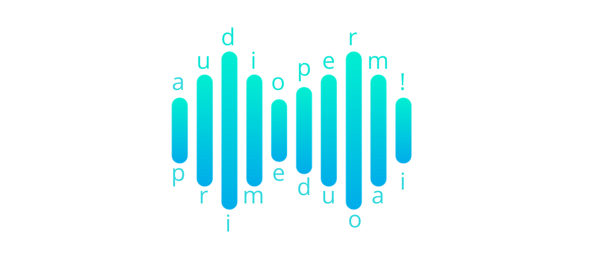

<p align="center">
  <a href="#"></a>
</p>
<p align="center">
    <em>Audioperm, a python library for generating different permutations of audible segments from audio files.</em>
</p>
<p align="center">
<a href="https://pypi.org/project/audioperm/" style="text-decoration: none;" target="_blank">
    
</a>
<a href="https://pypi.org/project/audioperm/" style="text-decoration: none;" target="_blank">
    
</a>
<a href="https://pypi.org/project/audioperm/" style="text-decoration: none;" target="_blank">
    
</a>

<a href="https://colab.research.google.com/github/zabir-nabil/audioperm/blob/main/notebooks/audioperm_demo.ipynb" style="text-decoration: none;">
  
</a>
</p>

---
### Audioperm
A python library for generating different permutations of audible segments from audio files. 

```console
pip install audioperm
```

#### Use:

* Silence Removal from Audio
* Audio / Speech augmentation
* Word segmentation
* Word level permutation generation
* Add new synthetic data for deep learning
* Speaker recognition, Speaker verification, Audio classification, Audio fingerprinting


**Documentation**: <a href="https://zabir-nabil.github.io/audioperm/" target="_blank">https://zabir-nabil.github.io/audioperm/</a>

**Source Code**: <a href="https://github.com/zabir-nabil/audioperm" target="_blank">https://github.com/zabir-nabil/audioperm</a>

---

#### Word segmentation

```python
from audioperm import AudioPerm
from audioperm.utils import save_audio

ap = AudioPerm("i_love_cats.m4a")
label = "i love cats"

words = ap.word_segments()
label_words = label.split()

for i, w in enumerate(words):
  save_audio(w, label_words[i] + ".wav")
```

```
cats.wav  i_love_cats.m4a  i.wav  love.wav
```

#### Word-level permutation

```python
import numpy as np
from audioperm import AudioPerm
from audioperm.utils import save_audio

ap = AudioPerm("i_love_cats.m4a")
ap.word_segments(return_words=False)
perm_sentences = ap.permute(n_permutations = 5)

for i, s in enumerate(perm_sentences):
  save_audio(s, f"perm_{i}.wav")
```

```
cats.wav	   i.wav       perm_1.wav    perm_4.wav
i_love_cats.m4a    love.wav    perm_2.wav    perm_0.wav  
perm_3.wav
```

#### `permutations` on multiple files

```python
from audioperm import read_audio, word_segments, permutations

ap = read_audio(["bangla_demo.wav", "i_love_cats.m4a"])
out = word_segments(ap)
perms = permutations(out, n_permutations = 5)
```

#### Fixed-length segments

* Generate fixed length audible segments (with permutation/augmentation)

```python
from audioperm import fixed_len_segments
fixed_len_segments("bangla_demo.wav", return_segments = False, save_path = "fls_out", save = True, segment_size = 0.5)
out = fixed_len_segments("bangla_demo.wav", return_segments = True, max_segments = 5, permute = True, save = False, segment_size = 0.5)
```

### Others

> To run the code: [Google Colab](https://colab.research.google.com/github/zabir-nabil/audioperm/blob/main/notebooks/audioperm_demo.ipynb)

> Any contribution is welcome. 
  - [Contributors](https://github.com/zabir-nabil/audioperm/graphs/contributors)
  - [Contribution guide](https://github.com/zabir-nabil/audioperm/blob/main/CONTRIBUTE.md) 

> Tested with: 
  - `python3.7`
  - `python3.8`

> Internal audio representation:
 - `PCM 16`
 - `float32`

> TO-DO:
 - [ ] multi-channel audio
 - [ ] augmentation
 - [ ] multi-processing
 - [ ] gpu-support